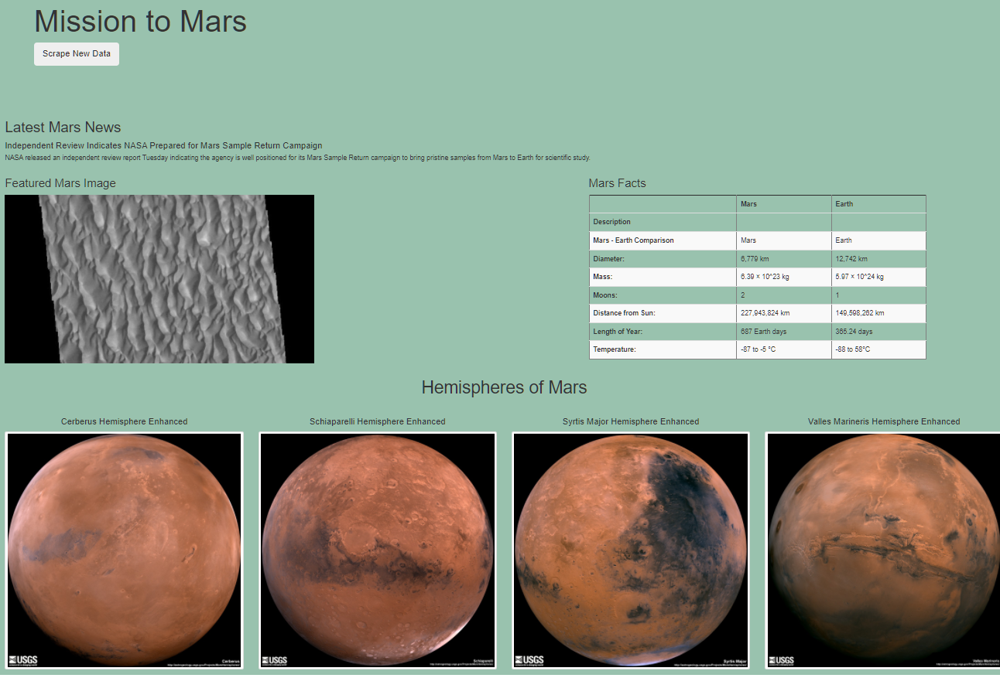

# Mission to Mars Scraped Web Page
## Tools Used:
- Pandas,
- Beautiful Soup,
- Splinter,
- Python

## Deliverable 1: Requirements and links to deliverable one.
### Requirements - D1
- Code that retrievees full-resolution image and title for each hemispheree image
- Full-resolution images of the hemispheres are added to dictionary
- Title for hemisphere images are added to dictionary
- List contains dictionary of full-resolution image URL string and title for each hemisphere image
- 
### Files D1
<a href="Mission_to_Mars_Challenge.ipynb">Jupiter File with Deliverable 1</a>

## Deliverable 2: Requirements and links to deliverable two.
### Requirements - D2
- Scraping file contains code that retrieves full-resolution image URL and title for each hemisphere image
- Mongo database is updated to contain full-resolution image URL and title for each hemisphere image
- Index file contains code that will display the full-resolution image URL and title for each hemisphere image
- After scraping complete, web page contains all images and titles for four hemisphere images

### Files D2
- <a href="https://github.com/TeresaWehmeier/Mission-to-Mars/blob/6a9a82ec32c7a83a2ad816f1a265832c97baa695/Scraping.py">Scraping.py file</a>
- <a href="templates/index.html">Index file</a>
- 
- 

## Deliverable 3: Requirements and links to deliverable three.
### Requirements - D3
- Add two other bootstrap 3 componenets
-   Added styled scraping button
-   Striped the mars fact table
-   Used cards for hemisphere images

### Files D3
- <a href="templates/index.html">Index file</a>
- - 

